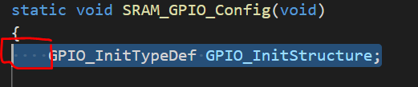
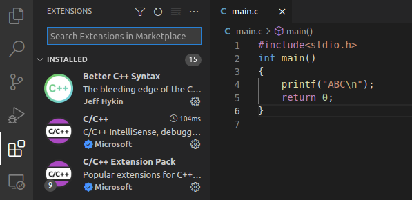
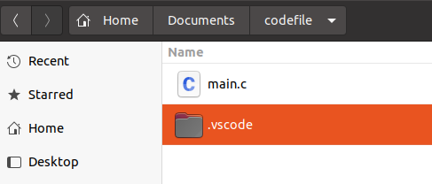
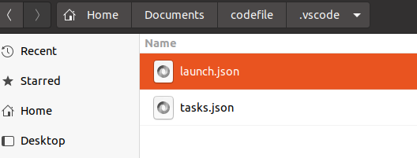

[toc]

<!-- toc -->

# VScode

## * default space 

The number of default space is two, sometimes we want change it to four.

 

 "File" --> "Preferences" --> "Settings" -->search for "editor.detectIndentation" , uncheck.

##  * Chinese shows messy code 

 

 "File" --> "Preferences" --> "Settings" -->search for "files.autoGuessEncoding" , check.

## * Font setting

"File" --> "Preferences" --> "Settings" -->search for "edit.font family" , put in "Noto Sans Mono CJK SC,monospace".

## * show the C++ putout to terminal

(1) installing extentions

 

(2) new a file named "main.c"

(3)typing the F5 choose "C++(GDB/LLDB)", it'll generate a file named "launch.json", rewrite the file with following code:

```json
{
    // Use IntelliSense to learn about possible attributes.
    // Hover to view descriptions of existing attributes.
    // For more information, visit: https://go.microsoft.com/fwlink/?linkid=830387
    "version": "0.2.0",
    "configurations": [
        {
            "name": "(gdb) Launch",
            "type": "cppdbg",
            "request": "launch",
            "program": "${workspaceFolder}/${fileBasenameNoExtension}.out",
            "args": [],
            "stopAtEntry": false,
            "cwd": "${workspaceFolder}",
            "environment": [],
            "externalConsole": false,
            "MIMode": "gdb",
            "preLaunchTask": "build",
            "setupCommands": [
                {
                    "description": "Enable pretty-printing for gdb",
                    "text": "-enable-pretty-printing",
                    "ignoreFailures": true
                }
            ]
        }
    ]
}
```

(4)in the same folder named ".vscode", new a file named "tasks.json" and type following code in it :

```json
{
    // See https://go.microsoft.com/fwlink/?LinkId=733558
    // for the documentation about the tasks.json format
    "version": "2.0.0",
    "tasks": [
        {
            "label": "build",
            "type": "shell",
            "command": "g++",
            "args": ["-g", "${file}", "-std=c++11", "-o", "${fileBasenameNoExtension}.out"]
        }
     ]
}
```

now, the relative files catalog is like this:

 

 

