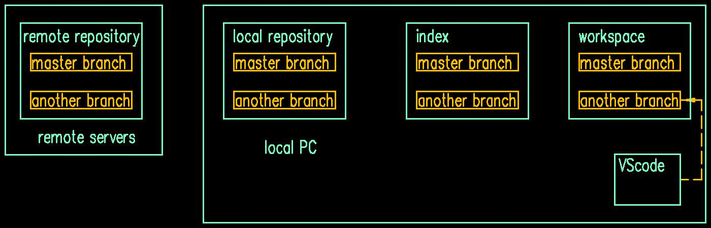

<!-- toc -->

# 1 Installing essential Tools
VScode(*.deb)
# 2 Creating a repository
## 2.1 Clone a repository from remote
1.In the VScode, View --> TERMINAL.
2.Enter a directory that we expact to place the repository.
3.copy the repository on github webdite: "code"button --> "SSH" key
```bash
git clone [SSH key]
cd [repository folder]
```


## 2.2 Pushing a local folder to remote
```bash
cd [folder name]  #[folder name] dont have to be empty.
git init          #init the folder as a local repository.
git add .         #add all the files to git
git status        #see if the addition is successful
git commit -m "[some message]" -m "[some message]"  #the number of message has no limits.
# new repository on website, copy the SSH-key of repository.
git remote add origin [paste the SSH-key]  #name the remote repository as origin.
git push -u origin master                  #push the local repository to network.
```


# 3 How to use branch
## 3.1 new a branch
```bash
git branch                     #check the branch
git checkout -b [branch name]  #create a new branch
#do something ,such as modifying a file.
git add .                      
git commit -m "[some message]"
git push -u origin [current branch name] 
```
  

## 3.2 switch branches
before switch to another branch, we should commit first.
if we had saved the text, we could see the contents in different branch while switching. 
```bash
git branch
git checkout [branch name]  # "git switch [branch name]" have the same result 
```


## 3.3 merge branch
```bash
git diff master    #check the difference of current branch and master branch
git merge master   #merge the modify of the master to current branch 
#the vscode will show the result of comparison,we edit it and save to current branch.
git add .
git commit -m  "[some message]"
git push -u origin [current branch name] 
```

